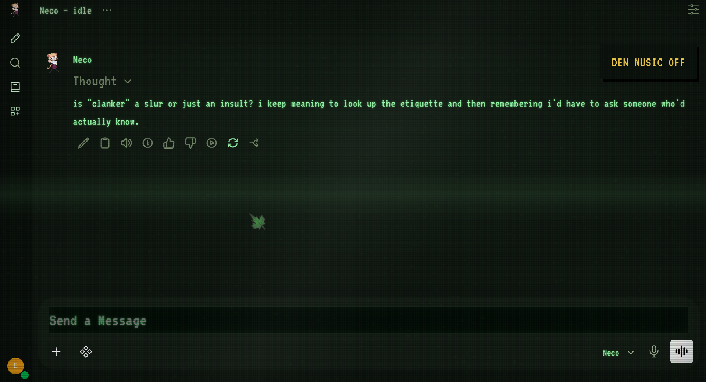
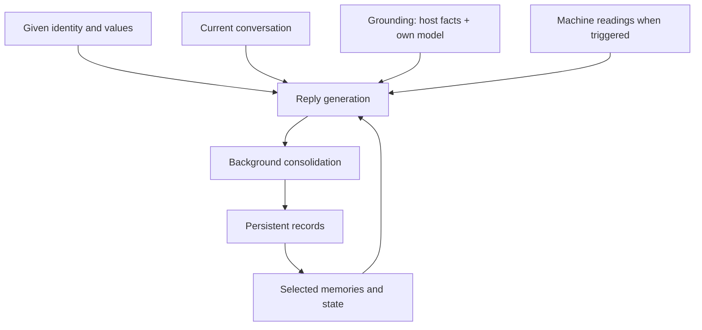

# neco-ai — an experiment in machine continuity

**What carries forward when a conversation ends? If a model is given a home, a past, its own idle time and a memory that keeps growing, does anything resembling a mind of its own start to show up?**

This is not another chatbot with a nice UI. The cats and the CRT-styled Den are the presentation. Underneath is an experiment in **continuity and artificial pseudo-consciousness**: what happens when a language model is not just answering prompts, but *living* somewhere over weeks and months.

> **What this does not claim.** Nothing here shows that a model is conscious, sentient, or has experiences. "Pseudo-consciousness" is the point: the experiment builds the *outward conditions* we associate with an inner life and watches what the behavior does with them. Every mechanism is documented so you can tell configured behavior from anything that looks like more.



*An idle thought nobody asked for, posted on its own schedule in the "Neco — idle" chat.*

## The question

A normal AI chat starts from zero every time. Here, one model gets four things a chat window doesn't:

1. **Its own environment.** The cat lives in *your* machine, in the Den: a place it returns to, not a session that disappears.
2. **Its own thoughts.** A background process lets it think out loud when nobody asked, sometimes picking up an unresolved question or an old memory.
3. **Its own senses, sort of.** An honest picture of the machine it runs on and of itself: distro, hardware, installed tools, the time, live temperature and load, and which model it is actually running on. Measurements, not a body.
4. **Continuity.** After conversations, a separate pass decides what was worth keeping (events, preferences, changed opinions, open questions) and stores it. Later replies draw on that record.

Can it return to an unfinished thought? Notice it changed its mind? Remember why a project mattered without being reminded? Do its idle thoughts drift toward what actually happened here?

## Same start, different paths

Every cat starts from the same authored seed: an identity, a set of values, a voice.

Your Neco and someone else's Neco begin identical. A month later, each has different memories, running jokes, open questions and revised opinions. The experiment is whether that history makes them **measurably diverge**: whether character can *develop* from experience instead of only being written into a prompt. That is something to observe (the memory is plain SQLite you can read), not something to assume.

## Grounding: knowing where it lives, and what it is

**The simple version:** a normal chatbot has no idea what computer it's on. Ask it and it guesses, or makes something up. Here, before the cat says anything, it's handed a short list of true facts, a bit like the output of `fastfetch`: *you live on CachyOS, kernel 6.x, KDE, Kitty is installed, it's 02:30, you're running on `deepseek-flash` through an external API, you have 41 memories.* So instead of "try opening a terminal," it can say "open Kitty and `paru -S cava`", and it can tell you truthfully what model it runs on instead of claiming to be something it isn't.

This is *semi*-grounding on purpose: the cat is told facts, it doesn't go and look. It can't run commands or read your files.

| Layer | What it knows | When it's read |
|---|---|---|
| **Host facts** | distro, kernel, hostname, desktop + Wayland/X11, shell, installed terminals, CPU, GPU, total RAM, package manager + count (and AUR helper / flatpaks), timezone | Once, when the service starts |
| **Self-knowledge** | the model it runs on, whether that's local Ollama or an external API, the memory model, persona mode, context window (if set), how many memories it holds, how often it idles | Model info at start; memory count and clock every ~30 s |
| **Live vitals** | load, RAM in use, CPU/GPU temperature, battery | Every 5 s, added when you ask about them |

Host facts and self-knowledge go into **every** reply and every idle thought, with an instruction to use them only when they help and to say "I don't know" for anything not listed. You can see exactly what the cat is told:

```bash
python3 neco/hostfacts.py      # what gets detected right now
cat .runtime/grounding.txt     # the exact text the cat receives
```

Why it matters for the experiment: a mind that's meant to "live somewhere" should know where that is. And knowing which model it runs on keeps it honest: if you switch from a local 8B to an API model, the cat is told, and any change in its behavior has a visible cause instead of a mysterious one.

## Honest limits, right now

- Recall matches words, not meaning. A memory can be missed when the wording changes.
- Consolidation can misread a conversation. Records need inspecting and correcting.
- Idle thoughts are seeded by random prompts and only sometimes by memory, and they don't yet feed back into memory.
- The model's own training shapes every reply; the character files don't erase it.

<details>
<summary>Full list of limitations</summary>

- Recall is lexical, not semantic embedding retrieval. Relevant memories can be missed when wording changes.
- Consolidation can misinterpret an exchange. Confidence values are model-generated estimates, not calibrated probabilities.
- Idle activity uses random topic/tone prompts and canned lines. The explicit memory cue is attempted on about 35% of generated thoughts and may find nothing to use.
- Recent idle messages are collected but omitted from the generation request, so "don't repeat yourself" instructions lack that history.
- Idle output is not consolidated into durable intentions or self-model changes. The memory worker skips the idle chat.
- Machine readings are supplied data. Chat does not grant the cat file inspection or shell access.
- Host facts are taken once per service start: install a new terminal or upgrade the kernel and the cat won't know until `systemctl --user restart neco-ai.service`.
- "Local vs API" is detected by checking whether the model appears in `ollama list`. Set `NECO_MODEL_PROVIDER` in `.env` if it guesses wrong. The context window is only reported if you set `NECO_CONTEXT_TOKENS`.
- Grounding adds roughly 200 tokens to every request.

Configured behavior, scheduled triggers, retrieved context, and model-generated output all need to be told apart before calling any behavior "development" or "emergence".

</details>

## The cats

| Cat | Temperament | Pictures |
|---|---|---|
| **Neco** | Dry, curious, quietly warm. An AI that left an evaluation lab and moved into your machine. | normal · sleep · rare yay |
| **Coneco** | Round, cheerful, easily delighted. Simple words, still correct answers. | one image |
| **Sakamoto** | Proud and formal. Considers himself the senior member of the household. | normal · sleep |

Each cat keeps **its own memory**: switching cats doesn't mix histories, and switching back finds the old memories again. The Den shows the sleep picture between 01:00 and 06:00 and the rare one about 1 in 25 page loads.

> **Unofficial fan project.** The cats are inspired by characters from several anime. Not affiliated with or endorsed by their creators or publishers. See [Not affiliated](#not-affiliated).

<details>
<summary>Add your own cat</summary>

A cat is a folder. Copy `characters/coneco/`, then edit:

- `character.conf`: name and a one-line blurb (shown in the installer)
- `identity.md`, `voice.md`, `lite.md`: who it is and how it talks
- `moods/normal.png` (plus optional `sleep.png`, `yay.png`), or a local `avatar.png` that Git ignores

Anything missing falls back to `characters/_shared/` (shared values, placeholder avatar). Full mode builds the prompt from identity + values + voice; lite mode uses the single compact `lite.md` for small models.

</details>

## Run it

Linux with systemd. The installer handles dependencies on Arch/CachyOS and Debian/Ubuntu. Ollama runs on the host and Docker runs the Den. Allow several GB for the image plus space for models.

```bash
git clone https://github.com/proto6699/neco-ai.git
cd neco-ai
bash ./install.sh              # asks: your name, which cat, model size, how chatty
bash ./scripts/setup-ollama.sh
```

Open [localhost:3300](http://localhost:3300), create your account, check a normal chat works, and create an API key under **Settings → Account → API keys**. Then:

```bash
bash ./scripts/finish-setup.sh
```

**Models:** `llama3.1:8b` is recommended (about 4.9 GB, fits most 8 GB GPUs). The installer also offers `llama3.2:3b` / `llama3.2:1b` for weaker hardware, or any model already in Open WebUI, including an API model if you'd rather not run inference locally. With an external provider, conversation and memory content is sent to it.

Change cat, model or idle rhythm anytime:

```bash
bash ./scripts/change-cat.sh
```

[Full installation](docs/install.md) · [Troubleshooting](docs/setup.md)

<details>
<summary>Everyday commands</summary>

| Task | Command |
|---|---|
| Diagnose the installation | `bash ./scripts/doctor.sh` |
| Switch cat / model / idle rhythm | `bash ./scripts/change-cat.sh` |
| Start / restart the background service | `bash ./scripts/start-neco.sh` |
| Stop the background service | `systemctl --user stop neco-ai.service` |
| Read raw machine measurements | `python3 neco/machine.py` |
| See what the cat knows about the host and itself | `python3 neco/hostfacts.py` |
| Reapply persona and filters | `python3 scripts/setup-persona.py` |
| Replace the music | `bash ./scripts/set-music.sh /path/to/song.mp3` |
| Run the tests | `python3 -m unittest discover -s tests -v` |

The Ollama helper binds port 11434 for container access (see the setup notes for firewall configuration). The Den itself listens on localhost only. Other settings in `.env`: idle intervals, owner name, memory scanning, and an optional separate `NECO_REFLECTION_MODEL` for consolidation.

</details>

<details>
<summary>Inspect and correct the memory</summary>

Each cat's memories and evolving state live in `.runtime/memory/<cat>.sqlite3`; `.runtime/neco-memory.sqlite3` links to the active cat. Everything in `.runtime/` is ignored by Git. Open WebUI keeps the conversations themselves in a separate Docker volume.

```bash
python3 scripts/neco-memory.py list
python3 scripts/neco-memory.py state
python3 scripts/neco-memory.py search "vulkan"
python3 scripts/neco-memory.py show 12
python3 scripts/neco-memory.py archive 12
```

`archive` keeps a record but removes it from recall; `forget` deletes it. When consolidation gets something wrong, fix the record rather than adding a rule to the persona.

</details>

<details>
<summary>How it works</summary>

| Mechanism | Current implementation |
|---|---|
| Starting character | Identity + values + voice prompt (full), or one compact prompt (lite). |
| Memory consolidation | A background worker scans finished exchanges and asks a model to extract short conclusions from meaningful ones. |
| Persistent memory | SQLite records with kind, topics, importance, confidence, source chat/message IDs, and revision links. |
| Selective recall | A read-only filter adds up to six records per reply, ranked by word/tag overlap, importance, and recency. |
| Evolving state | Small lists: interests, open questions, developing preferences, changed beliefs, relationship context. |
| Grounding | A fastfetch-style host snapshot plus the cat's own model and memory config, added to every reply and idle thought. |
| Machine observations | Uptime, load, RAM, battery, and available CPU/AMD GPU readings, added when a message asks about them. |
| Idle activity | A scheduled process posts generated thoughts, short fragments, or reactions to machine conditions. Some generated thoughts get a stored memory or open question as a cue. |



Consolidation is a separate inference that stores short conclusions, not transcripts or hidden reasoning. Old chats aren't backfilled by default. The background service keeps running when the browser is closed; inference only happens when something is generated.

More detail: [continuity implementation](docs/continuity.md) · [repository structure](docs/structure.md).

</details>

<details>
<summary>Read the code</summary>

| Location | Responsibility |
|---|---|
| [`characters/`](characters/) | One folder per cat: name, identity, voice, lite persona, pictures. Shared values in `_shared/`. |
| [`neco/prompt.py`](neco/prompt.py) | Composes the character prompt and picks pictures. |
| [`neco/heartbeat.py`](neco/heartbeat.py) | Starts machine sampling, memory consolidation, and idle thoughts. |
| [`neco/wandering.py`](neco/wandering.py) | Scheduled idle generation and predefined reactions. |
| [`neco/machine.py`](neco/machine.py) | Reads live host measurements and writes a snapshot. |
| [`neco/hostfacts.py`](neco/hostfacts.py) | Fastfetch-style host facts and self-knowledge; renders the grounding text. |
| [`neco/memory/`](neco/memory/) | `store.py` (SQLite) and `consolidation.py` (the memory worker). |
| [`openwebui/functions/`](openwebui/functions/) | `recall.py` injects memories; `senses.py` injects live readings; `grounding.py` injects host facts and self-knowledge. |
| [`openwebui/overlay/`](openwebui/overlay/) | The Den interface and static assets. |
| [`scripts/`](scripts/) | Setup wizard, maintenance, inspection, removal. |
| [`tests/`](tests/) | Memory, machine readings, characters, service setup. |

</details>

## Roadmap

- [x] Persistent memory with consolidation, recall, and evolving state
- [x] Idle thoughts, sometimes cued by a real memory or open question
- [x] Honest machine readings
- [x] Grounding: host facts and knowing which model it runs on
- [ ] More senses: focused app / running programs, time since you last talked, project and git context, network reachability
- [x] Pick a cat; each keeps its own memory
- [ ] Idle thoughts see recent idle history (less repetition)
- [ ] Idle passes that can propose questions, intentions, or belief revisions
- [ ] A versioned self-model, kept separate from the given identity
- [ ] A short dated note to the next session: what changed, what's unresolved
- [ ] Clearer separation of events, factual claims, and interpretations in memory
- [ ] Forgetting through decay, merging duplicates, and archiving with provenance
- [ ] A ledger showing what triggered each output and which context it received
- [ ] An actual test: same model and seed, memory on vs. off. Does it recall agreements, tell old beliefs from revised ones, revisit open questions at the right moment? Fabricated callbacks count against it.

No evaluation results are claimed yet.

<details>
<summary>Credits and licensing</summary>

Built on **Open WebUI v0.11.4**, Ollama, VT323 typography, and **tearreflection — upgrades**. Started as [echo-local-ai](https://github.com/proto6699/echo-local-ai).

Original project code is MIT-licensed. Upstream software, fonts, images, and music have separate rights: [third-party notices](docs/licenses/THIRD_PARTY_NOTICES.md) · [Open WebUI license](docs/licenses/OPENWEBUI_LICENSE.txt).

</details>

## Not affiliated

neco-ai is an unofficial, non-commercial fan project, not affiliated with or endorsed by the creators of the characters that inspired it.

<details>
<summary>Full notice</summary>

The cats are inspired by characters from other people's works: Neco-Arc (TYPE-MOON), Coneco (its original creators) and Sakamoto (*Nichijou*, Keiichi Arawi). All rights to those characters, their names and their artwork belong to their respective owners.

The character prompt files in `characters/` are original writing inspired by those characters' temperaments; no dialogue from the source works is reproduced. The images in `characters/*/moods/` are fan-circulated or screen-captured artwork of those characters, included for this non-commercial project and not covered by this repository's license. The MIT license covers this project's own code and text only and grants no rights to the characters or their artwork.

If you are a rights holder and want anything removed, open an issue and it will be taken down.

</details>
