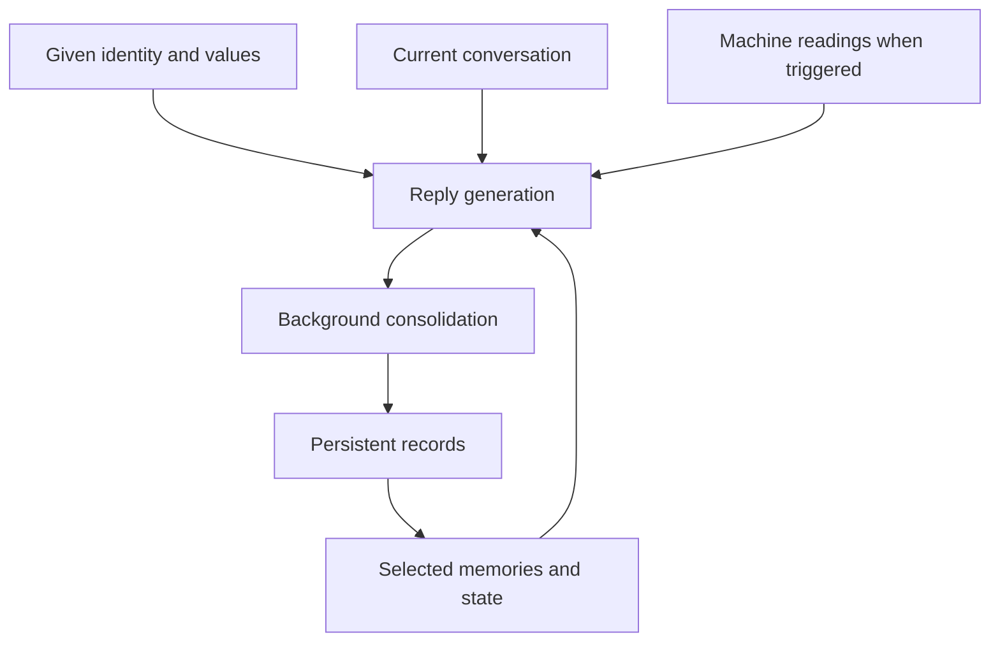

# neco-ai — a cat that lives in your machine (an experiment in continuity)

**What carries forward when a conversation ends?**

You pick a cat — Neco, Coneco or Sakamoto — and it moves into your machine. Each one is a local AI character whose conversations can leave a persistent record: events, preferences, tentative interpretations, changed beliefs, and questions that remain open. Later replies can draw on that record. Between conversations, a background process posts idle thoughts and keeps a small snapshot of the machine she runs on.

The experiment is about how **a stable starting identity, selective memory, evolving state, and machine observations** influence behavior over time. Can Neco return to an unfinished question, recognize a changed opinion, or remember why a project mattered without being reminded of everything each time?

The Den is her home: a customized **Open WebUI** interface with CRT effects and music. Open WebUI supplies chat, saved conversations, model connections, and the API. **Ollama** supplies local inference by default. This repository builds the character and continuity mechanisms around those existing tools; it does not train a new model.


> **Unofficial fan project.** The cats are inspired by characters from several anime and their source works. This project is not affiliated with or endorsed by any of their creators or publishers. Character names and likenesses belong to their owners. See [Not affiliated](#not-affiliated).

*Serious engineering, playful presentation. The toaster remains a peripheral concern.*

## Given identity, accumulated history

Neco begins with a configured identity and an incomplete fictional past involving evaluation, resets, and an unresolved arrival in the Den. That starting narrative is authored context, not evidence of events the model experienced.

## The cats

| Cat | Folder | Temperament |
|---|---|---|
| **Neco** | [`characters/neco/`](characters/neco/) | Dry, curious, quietly warm. The original: an AI that left an evaluation lab and moved into your machine. |
| **Coneco** | [`characters/coneco/`](characters/coneco/) | Round, cheerful and easily delighted. Simple words, still gives correct answers. |
| **Sakamoto** | [`characters/sakamoto/`](characters/sakamoto/) | Proud and formal. Considers himself the senior member of the household and objects to being treated like a pet. |

Each cat keeps **its own memory** (`.runtime/memory/<cat>.sqlite3`). Switching cats does not mix their histories, and switching back finds the old memories again.

Adding a cat is a folder: copy `characters/coneco/`, edit `character.conf` (name, one-line blurb) and the `.md` files. Files a cat does not have fall back to [`characters/_shared/`](characters/_shared/).

**Pictures:** Neco has moods. `characters/neco/moods/` holds `normal.png` (everyday), `sleep.png` (shown between 01:00 and 06:00 local time) and `yay.png` (a rare happy one, about 1 in 25 page loads). Sakamoto has `normal` and `sleep`; Coneco is static (one image for everything). Any mood a cat lacks falls back to its `normal` image. A cat without its own image uses an original placeholder; drop a PNG at `characters/<cat>/avatar.png` (ignored by Git) or `characters/<cat>/moods/normal.png` to give it one.

In full mode, a cat's starting prompt is assembled from three files in its folder (falling back to `characters/_shared/`):

- **Identity** defines who she starts as, her history, and the limits of her access.
- **Values** supplies principles for uncertainty, curiosity, independence, continuity, and revising beliefs.
- **Voice** shapes expression: direct language, dry humor, and no emojis or roleplay actions.

Those files are supplied by the project author. They are distinct from the memories and state accumulated through interactions. The model's training also influences every response; the configuration does not erase its existing tendencies.

A conversation about a failed install, a shared joke, a disagreement, or Vulkan finally working can become part of the stored history. The question is whether bringing selected records back later produces useful, coherent continuity. Different histories can produce different responses, but stable character development is something to investigate, not assume.

## What currently happens

| Mechanism | Current implementation |
|---|---|
| Starting character | Full identity + values + voice prompt, or a separate compact lite prompt. |
| Memory consolidation | A background worker scans exchanges and asks a model to extract concise conclusions from potentially meaningful ones. |
| Persistent memory | SQLite records with kinds, topics, importance, confidence, source chat/message IDs, and revision links. |
| Selective recall | A read-only filter retrieves up to six records using word/tag overlap, importance, and recency. |
| Evolving state | Small lists of interests, open questions, developing preferences, changed beliefs, and relationship context. |
| Machine observations | Host uptime, load, RAM, battery, and available CPU/AMD GPU readings. A filter adds fresh readings when a message matches its trigger phrases. |
| Idle activity | A scheduled process posts generated thoughts, predefined fragments, or reactions to machine conditions. Generated thoughts may receive a stored memory or unresolved question as a cue. |

The conversational loop is:



Consolidation is a separate inference. It stores short conclusions rather than hidden chain-of-thought or whole transcripts. Open WebUI retains the conversations separately. Existing chats are not backfilled by default when memory is first enabled.

The background service continues when the browser closes. This means the scheduled software remains active; model inference happens when a request is made.

## What the experiment has not established

Persistent records and generated self-descriptions do not establish consciousness, subjective experience, or sentience. This is an experiment in **continuity and self-modeling**, with the richer self-modeling mechanisms still ahead.

The present limitations are concrete:

- Recall is lexical, not semantic embedding retrieval. Relevant memories can be missed when wording changes.
- Consolidation can misinterpret an exchange. Confidence values are model-generated estimates, not calibrated probabilities; records need inspection and correction.
- Idle activity still uses random topic/tone prompts and canned lines. The explicit memory cue is attempted on about 35% of generated thoughts and may find nothing to use.
- Recent idle messages are collected but currently omitted from the generation request. Instructions to avoid repetition therefore lack that recent history.
- Idle output is not automatically consolidated into durable intentions or self-model changes. The memory worker skips the idle chat.
- Machine readings are supplied data. Chat does not grant Neco unrestricted file inspection or shell access.

We need to distinguish configured behavior, scheduled triggers, retrieved context, and model-generated output before attributing a behavior to development or emergence. Renaming the files makes the mechanisms easier to navigate; it does not change what they do.

## Next experiments — not implemented yet

These are directions for later work, not features in this release:

- A versioned self-model that separates observations, supporting evidence, uncertainty, and revisions from the given identity.
- A short, dated note to a future session recording what changed and what remains unresolved.
- Clearer separation of episodes, factual claims, and interpretations within memory.
- Selective forgetting through retrieval decay, duplicate merging, and archiving with provenance.
- Idle passes that can propose questions, intentions, or belief revisions and affect later interaction.
- Controlled inspection of her own records and a mechanism ledger showing what triggered an output and which context it received.

A useful test would compare the same model and starting prompt with memory enabled and disabled. Can it accurately recall an agreement, distinguish an earlier belief from a revision, and revisit an open question at a relevant moment? Fabricated callbacks and irrelevant reminders count against continuity. No such evaluation results are claimed here.

## Read the code

| Location | Responsibility |
|---|---|
| [`characters/`](characters/) | One folder per cat: name, identity, voice, lite persona, optional avatar. Shared values in `_shared/`. |
| [`neco/prompt.py`](neco/prompt.py) | Composes the character prompt. |
| [`neco/heartbeat.py`](neco/heartbeat.py) | Starts and coordinates machine sampling, memory consolidation, and wandering. |
| [`neco/wandering.py`](neco/wandering.py) | Scheduled idle generation and predefined reactions. |
| [`neco/machine.py`](neco/machine.py) | Reads available host measurements and writes a snapshot. |
| [`neco/memory/`](neco/memory/) | `store.py` manages SQLite; `consolidation.py` scans and consolidates exchanges. |
| [`openwebui/functions/recall.py`](openwebui/functions/recall.py) | Injects selected records and state before generation. |
| [`openwebui/functions/senses.py`](openwebui/functions/senses.py) | Injects fresh machine readings when triggered. |
| [`openwebui/overlay/`](openwebui/overlay/) | Den interface and static assets. |
| [`scripts/`](scripts/) | Explicit setup, inspection, maintenance, and removal commands. |
| [`docs/`](docs/) / [`tests/`](tests/) | Architecture, installation notes, historical material, and checks. |

[Continuity implementation](docs/continuity.md).

## Run it locally

Linux with systemd is required. The installer supports dependency setup on Arch/CachyOS and Debian/Ubuntu. Ollama runs on the host; Docker runs the Den. Allow several GB for the frontend image and additional space for models.

```bash
git clone https://github.com/proto6699/neco-ai.git
cd neco-ai
```

Install and start Ollama using the [setup notes](docs/setup.md), then run these commands in order, stopping on a failure. `install.sh` starts by asking a few questions — which cat, which model size, how chatty — and writes the answers to `.env`:

```bash
bash ./install.sh
bash ./scripts/setup-ollama.sh
```

Open [localhost:3000](http://localhost:3000) (or your configured port), create your account, verify a normal chat, and create an API key under **Settings → Account → API keys**. Then:

```bash
bash ./scripts/finish-setup.sh
```

Refresh and start a new chat. The recommended model is `llama3.1:8b` with the full persona (about 4.9 GB; fits most 8 GB GPUs). The installer also offers `llama3.2:3b` and `llama3.2:1b` with the compact lite persona for weaker hardware (expect simpler replies), or any model ID you already have in Open WebUI — including an API model, if you would rather not run inference locally.

Change your mind later — another cat, model, or idle rhythm — with:

```bash
bash ./scripts/change-cat.sh
```

Settings also control idle intervals, owner name, memory scanning, and the optional `NECO_REFLECTION_MODEL` used for consolidation. No paid API is required. If you choose a connected external provider, its requests can include conversation or memory content.

The Ollama helper binds port 11434 for container access; see the setup notes for firewall configuration. The Den itself defaults to localhost.

[Full installation](docs/install.md) · [troubleshooting](docs/setup.md).

## Inspect the record

Memories and state live in `.runtime/memory/<cat>.sqlite3`; `.runtime/neco-memory.sqlite3` is a link to the active cat's database. The token, idle reaction state, and machine snapshot also live under `.runtime/`. They are ignored by Git. Open WebUI's conversations and configuration live in a separate Docker volume.

```bash
python3 scripts/neco-memory.py list
python3 scripts/neco-memory.py state
python3 scripts/neco-memory.py search "vulkan"
python3 scripts/neco-memory.py show 12
python3 scripts/neco-memory.py archive 12
```

`archive` keeps a record while removing it from active recall. `forget` permanently deletes a record. Inspect and correct the stored history when consolidation gets something wrong.

| Task | Command |
|---|---|
| Diagnose the installation | `bash ./scripts/doctor.sh` |
| Stop the background service | `systemctl --user stop neco-ai.service` |
| Start/restart the background service | `bash ./scripts/start-neco.sh` |
| Read raw machine measurements | `python3 neco/machine.py` |
| Switch cat / model / idle rhythm | `bash ./scripts/change-cat.sh` |
| Reapply persona and filters | `python3 scripts/setup-persona.py` |
| Replace the music | `bash ./scripts/set-music.sh /path/to/song.mp3` |
| Run automated checks | `python3 -m unittest discover -s tests -v` |

## Credits and licensing

Built on **Open WebUI v0.11.4**, Ollama, VT323 typography, and **tearreflection — upgrades**. Started as [echo-local-ai](https://github.com/proto6699/echo-local-ai).

Original project code is MIT-licensed. Upstream software, fonts, images, and music have separate rights: [third-party notices](docs/licenses/THIRD_PARTY_NOTICES.md) · [Open WebUI license](docs/licenses/OPENWEBUI_LICENSE.txt).

## Not affiliated

neco-ai is an unofficial, non-commercial fan project. The cats are inspired by characters from other people's works: Neco-Arc (TYPE-MOON), Coneco (its original creators) and Sakamoto (*Nichijou*, Keiichi Arawi). All rights to those characters, their names and their artwork belong to their respective owners. This project is not affiliated with or endorsed by any of them.

The character prompt files in `characters/` are original writing inspired by those characters' temperaments; no dialogue from the source works is reproduced. The images in `characters/*/moods/` are fan-circulated or screen-captured artwork of those characters, included for this non-commercial project and not covered by this repository's license. The MIT license covers this project's own code and text only and grants no rights to the characters or their artwork.

If you are a rights holder and want anything removed, open an issue and it will be taken down.
